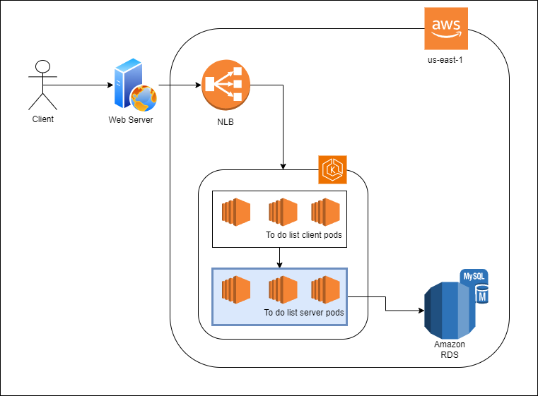

# to-do-list-server

## API Description
This repository is the server that is part of a web application project that provides a basic to-do list for people to organize their daily routine

## Architecture Diagram 


# API Contract

## Endpoints:
`http://{NLB_URL}/todo-server/`

## POST - /signup
Signs up the users

### Request params
| Parameter | Location    | Mandatory | Description                                         |
| :---:     | :---:       | :---:     | :---:                                               |
| username  | body        | yes       | Username    										|
| password  | body        | yes       | Password created for the given username 			|
| requestId | Header      | no        | Unique identifier of the request (UUID formatted) 	|

### Response
#### Success
- Status Code: 201
- Content:
```
{
	"data": {
		"message": "User successfully signed up"
	}
}
```

#### User already exist
- Status Code: 409
- Content:
```
{
	"data": {
		"message": "User already exists, try another user or log in to your account"
	}
}
```

#### Bad request
- Status Code: 400
- Content:
```
{
	"data": {
		"message": "There are some fields errors"
		"fields": [
			"fieldName": "field error message"
		]
	}
}
```

## POST - /login
Logs in the users and returns their ID

### Request params
| Parameter | Location    | Mandatory | Description                             |
| :---:     | :---:       | :---:     | :---:                                   |
| username  | body form   | yes       | Username    							|
| password  | body form   | yes       | Password created for the given username |
| requestId | Header      | no        | Unique identifier of the request (UUID formatted) |

### Response
#### Success
- Status Code: 201
- Content:
```
{
	"data": {
		"userId": "{userId}"
	}
}
```

#### Authentication Failed
- Status Code: 401
- Content:
```
{
	"data": {
		"message": "Username or password are incorrect"
	}
}
```

#### Bad request
- Status Code: 400
- Content:
```
{
	"data": {
		"message": "There are some fields errors"
		"fields": [
			"fieldName": "field error message"
		]
	}
}
```

## GET - /users/{userId}/tasks
Return all tasks created by the given user

### Request params
| Parameter  | Location    | Mandatory | Description                                       |
| :---:      | :---:       | :---:     | :---:                                             |
| userId     | path        | yes       | Unique identifier of the user (UUID formatted)    |
| requestId  | Header      | no        | Unique identifier of the request (UUID formatted) |
| isCompleted  | query       | no        | Filter only completed/uncompleted tasks (default: all) |

### Response
#### Success
- Status Code: 200
- Content:
```
{
	"data": {
		"tasks": [
			"task": {
				"taskId": "4935bee5-d788-4d07-9d6b-42a78ce22feb",
				"taskMessage": "task test",
				"createdAt": "01/01/2000",
				"isTaskCompleted": false
			},
			"task": {
				"taskId": "1e1665c2-c8b5-4da7-8cc0-0bd6d2b93bec",
				"taskMessage": "another task test",
				"createdAt": "01/01/2005",
				"isTaskCompleted": true
			}
		]
	}
}
```

#### Authentication Failed
- Status Code: 401
- Content:
```
{
	data: {
		message: "Invalid token"
	}
}
```

#### Bad request
- Status Code: 400
- Content:
```
{
	data: {
		message: "There are some fields errors"
		fields: [
			fieldName: field error message
		]
	}
}
```

## POST - /users/{userId}/tasks
Insert a new tasks for the given user

### Request params
| Parameter  | Location    | Mandatory | Description                                       |
| :---:      | :---:       | :---:     | :---:                                             |
| userId     | path        | yes       | Unique identifier of the user (UUID formatted)    |
| requestId  | Header      | no        | Unique identifier of the request (UUID formatted) |

### Request body
```
{
	"taskMessage": "test message" 
}
```


### Response
#### Success
- Status Code: 201
- Content:
```
{
	"data": {
		"task": {
			"taskId": "4935bee5-d788-4d07-9d6b-42a78ce22feb",
			"taskMessage": "test message",
			"createdAt": "01/01/2000",
			"isTaskCompleted": false
		}
	}
}
```

#### Authentication Failed
- Status Code: 401
- Content:
```
{
	data: {
		message: "Invalid token"
	}
}
```

#### Bad request
- Status Code: 400
- Content:
```
{
	data: {
		message: "There are some fields errors"
		fields: [
			fieldName: field error message
		]
	}
}
```

## PUT - /users/{userId}/tasks/{taskId}
Update a task message for the given user and task

### Request params
| Parameter  | Location    | Mandatory | Description                                       |
| :---:      | :---:       | :---:     | :---:                                             |
| userId     | path        | yes       | Unique identifier of the user (UUID formatted)    |
| taskId     | path        | yes       | Unique identifier of the task (UUID formatted)    |
| requestId  | Header      | no        | Unique identifier of the request (UUID formatted) |

### Request body
```
{
	"taskMessage": "new test message" 
}
```


### Response
#### Success
- Status Code: 204

#### Authentication Failed
- Status Code: 401
- Content:
```
{
	data: {
		message: "Invalid token"
	}
}
```

#### Bad request
- Status Code: 400
- Content:
```
{
	data: {
		message: "There are some fields errors"
		fields: [
			fieldName: field error message
		]
	}
}
```

## PATCH - /users/{userId}/tasks/{taskId}/completeness
Update task completion status for the given user and task

### Request params
| Parameter  | Location    | Mandatory | Description                                       |
| :---:      | :---:       | :---:     | :---:                                             |
| userId     | path        | yes       | Unique identifier of the user (UUID formatted)    |
| taskId     | path        | yes       | Unique identifier of the task (UUID formatted)    |
| requestId  | Header      | no        | Unique identifier of the request (UUID formatted) |


### Response
#### Success
- Status Code: 204

#### Authentication Failed
- Status Code: 401
- Content:
```
{
	data: {
		message: "Invalid token"
	}
}
```

#### Bad request
- Status Code: 400
- Content:
```
{
	data: {
		message: "There are some fields errors"
		fields: [
			fieldName: field error message
		]
	}
}
```
## Installation guide

### Install protocol buffer and go plugins for protobuf

First, you need to have golang installed. After that, run the following commands:
```
apt install -y protobuf-compiler
protoc --version
go install google.golang.org/protobuf/cmd/protoc-gen-go@latest
go install google.golang.org/grpc/cmd/protoc-gen-go-grpc@latest
```

In order to the following commands work, is also necessary that you include the GOPATH in the PATH env variable:
```
export PATH="$PATH:$(go env GOPATH)/bin"
```

### Generate the .pb.go files
```
protoc --go_out=. --go_opt=paths=source_relative --go-grpc_out=. --go-grpc_opt=paths=source_relative ./app/config/grpc/to_do_list.proto
```

### Install golang and its dependencies
```
cd app/
go mod init
apt-get -y install make
make deploy

```

# References used during the project:
- https://blog.logrocket.com/jwt-authentication-go/
- https://dave.cheney.net/practical-go/presentations/qcon-china.html
- https://grpc.io/docs/languages/go/basics/
- https://medium.com/@cheickzida/golang-implementing-jwt-token-authentication-bba9bfd84d60
- https://medium.com/@rnp0728/secure-password-hashing-in-go-a-comprehensive-guide-5500e19e7c1f
- https://medium.com/@wahyubagus1910/build-scalable-restful-api-with-golang-gin-gonic-framework-43793c730d10

cd ./infra/database
docker build -t "to-do-list-database:1.0" --target database .
kubectl apply -f ./database-kubernetes.yml
cd ../../app
docker build -t "to-do-list-server:v1" --target application .
cd ../infra
kubectl apply -f ./application-kubernetes.yml